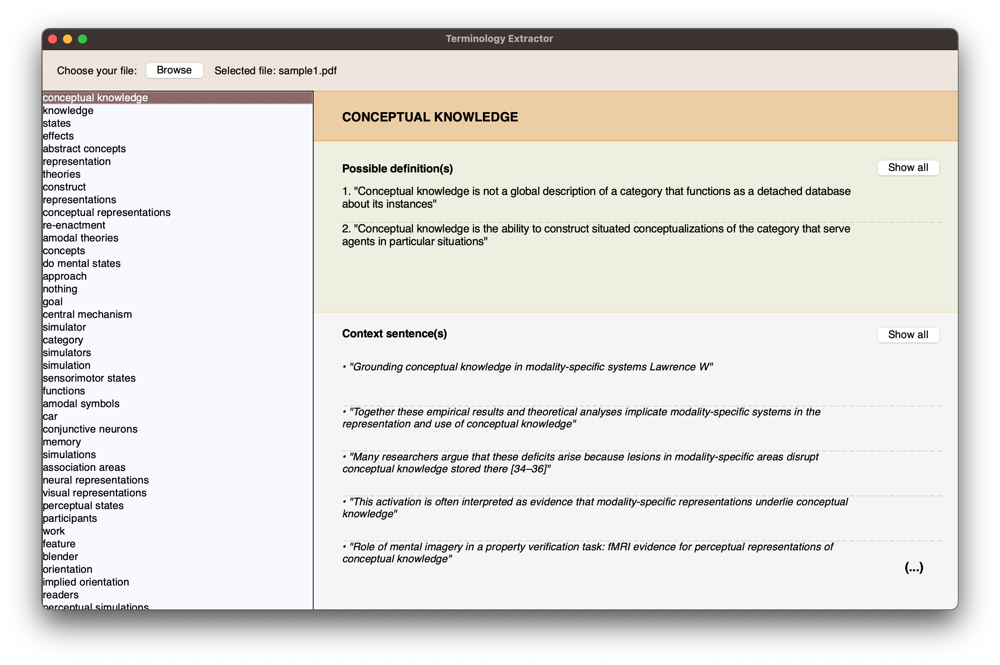
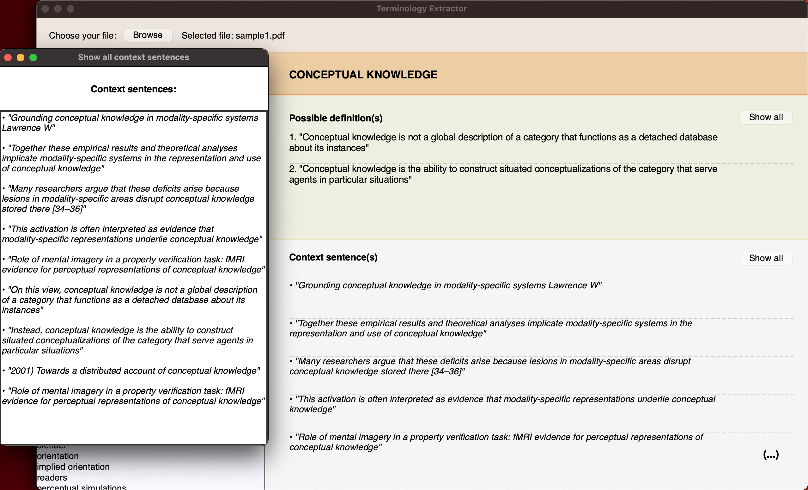

# Automatic Extraction and Representation of Scientific Terminology

## Table of Contents

- [Description](#Description)
- [Development/Requirements](#Development-requirements)
- [Setup and usage](#Setup-and-usage)
- [Inspiration](#Inspiration)
- [Authors](#Authors)

## Description
   
This NLP-based terminology extractor enables fast and clear representation of terminology used in English-language scientific papers.  
Relying on regex patterns, it extracts data from an unstructured text — in this case, a scientific article in .pdf format.  
A GUI — **optimized for macOS** — allows for browsing through directories, selecting the file and displaying terminology candidates, their possible definitions and context sentences in which they occur.

## Development/Requirements
* Python 3.10.1
* PyMuPDF — Python binding for MuPDF, a lightweight PDF viewer, renderer, and toolkit
* NLTK — suite of libraries for symbolic and statistical NLP
* Re — module supporting use of regex
* os — module providing functions for interacting with the operating system
* TKInter — Python interface to Tcl/Tk GUI toolkit

## Setup and usage
Clone this repo and install the required libraries. Run the full script by running `GUI.py` or access each module by running them individually. 

## Inspiration
Inspired by SketchEngine's [OneClickTerms](https://terms.sketchengine.eu/how-does-it-work).

## Authors
☻ [Ruslan Davletshin](https://github.com/ruslandavlet) — `Text pre-processing`, `Data Extraction`  
☻ [Chiara Cagnino](https://github.com/ccagnino) — `TermEntry`, `GUI`
